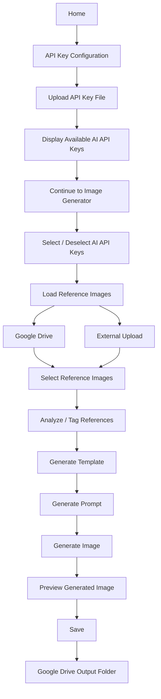
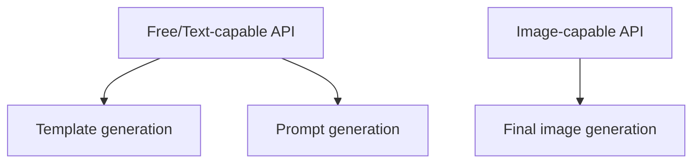
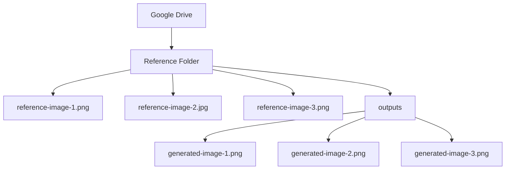

# Agentic Content Generator

An AI-powered content and image generation application that uses reference images, AI-generated templates, prompts, and multiple AI API providers to create images and other content.

The application supports Google Drive as a reference-image source and output storage location, multiple AI API keys, AI-based image tagging, template generation, prompt generation, image generation, and optional editable-design workflows.

---

## Features

### AI API Key Management

- Upload an API-key configuration file.
- Supports multiple API keys.
- Supports selecting multiple API keys.
- Selected API keys are highlighted in the UI.
- API keys can be changed during the generation workflow.
- Different AI providers can be used for different stages of the pipeline.
- The application validates whether the selected provider can perform the required operation.

Supported providers include:

- Gemini
- OpenRouter
- Claude

---

## Reference Image Management

Reference images can be obtained from:

- Google Drive
- External image uploads
- Other supported reference sources

Google Drive is used as a reference/storage service and is not treated as an AI API provider.

The application can read images from the configured Google Drive reference folder.

### Google Drive Reference Folder

The application uses a configured Google Drive folder as the source of reference images.

Example:

```text
GOOGLE_DRIVE_FOLDER_ID=<google-drive-folder-id>
The application queries Google Drive for files contained in this folder and uses supported images as references.
```
### Image Generation Workflow

The main generation workflow is:

Also, I recommend using **quoted labels** instead of underscores if you want the rendered diagram to look professional:



### AI Image Tagging

Reference images can be analyzed by the AI pipeline to generate semantic tags.

The purpose of tagging is to help the application understand the visual content of the reference image before template and prompt generation.

The backend contains an image-tagging service that communicates with the configured AI provider.

### Template Generation

After a reference image is selected, the application can generate a structured template describing the visual characteristics of the reference.

The generated template can contain information such as:

Layout
Visual structure
Text placement
Image placement
Typography
Colors
Design elements
Composition

The template is then used as an input for prompt generation.

### Prompt Generation

The generated template and reference information are used to create an image-generation prompt.

The prompt-generation stage converts the structured design requirements into instructions suitable for the selected image-generation model.

### Image Generation

The final image is generated using an image-capable AI API.

The application distinguishes between APIs that can perform:

Text generation
Vision/image analysis
Prompt generation
Image generation

A provider that can generate text but cannot generate images cannot be used for the final image-generation stage.

### Multiple API Key Selection
The application supports selecting multiple API keys.

For example:

[ Gemini API ] [ OpenRouter API ] [ Claude API ]

Multiple keys can be selected simultaneously.

The selected keys are used by the backend according to their capabilities.
#### Pipeline Example
A selected API configuration may allow:

If the currently selected image-generation provider cannot generate the final image, another selected compatible provider can be used.
The application also supports changing the selected API keys without restarting the complete workflow.
### Google Drive Integration
Google Drive is used for reference images and generated-output storage.

The backend uses Google Drive OAuth authentication.

The OAuth files used by the backend are:

credentials.json
token.json

For Railway deployment, these files can be recreated from Base64-encoded environment variables.

GOOGLE_DRIVE_CREDENTIALS_JSON_B64
GOOGLE_DRIVE_TOKEN_JSON_B64

The application initializes the OAuth files during backend startup.
### Google Drive Folder Configuration
The application can be configured using:

GOOGLE_DRIVE_FOLDER_ID=<reference-folder-id>
GOOGLE_DRIVE_OUTPUT_FOLDER_ID=<output-folder-id>

Example:

GOOGLE_DRIVE_FOLDER_ID=your-reference-folder-id
GOOGLE_DRIVE_OUTPUT_FOLDER_ID=your-output-folder-id

The reference folder contains the images used as input.

The output folder is used for storing generated images.
### Output Folder
Generated images are saved into the configured Google Drive output folder.

The intended folder structure is:


The application can save generated images after the user selects the save operation.
### Backend
The backend is implemented using:

Python
FastAPI
Google Drive API
Google OAuth
AI provider APIs

The backend is located in:

backend/

Main application:

backend/app/main.py
### Backend Structure
A simplified structure is:
```mermaid
flowchart TD
    backend-->app
    app-->main.py
    app-->services
    services-->prompt_generator.py
    services-->template_builder.py
    services-->document_reference_service.py
    services-->editable_design_service.py
    services-->canva_mcp_service.py
    services-->canva_connect_service.py
    app-->input
    app-->uploads
    app-->templates
    app-->output
    requirements_txt["requirements.txt"]
````
### Frontend
The frontend is implemented using:

React
TypeScript
Vite

The frontend communicates with the FastAPI backend through REST APIs.

Typical structure:

```mermaid
graph TD
    A["frontend/"]
    A --> B["src/"]
    B --> C["App.tsx"]
    B --> D["App.css"]
    A --> E["components/"]
    A --> F["services/"]
    A --> G["package.json"]
    A --> H["vite.config.ts"]
```
### API Key Configuration
The application accepts an API-key configuration file.

Example structure:

GEMINI_API_KEY_1=your-key
GEMINI_API_KEY_2=your-key

OPENROUTER_API_KEY_1=your-key

CLAUDE_API_KEY_1=your-key

GOOGLE_DRIVE_FOLDER_ID=your-reference-folder-id
GOOGLE_DRIVE_OUTPUT_FOLDER_ID=your-output-folder-id

Do not commit real API keys to GitHub.
### Start Backend
From the project root:

uvicorn app.main:app --reload --port 8000

Or from the backend directory:

uvicorn app.main:app --reload --port 8000

The backend will normally be available at:

http://localhost:8000
### Frontend Setup
Open another terminal.

Move into the frontend:

cd frontend

Install dependencies:

npm install

Start the development server:

npm run dev

The Vite development server will provide the frontend URL in the terminal.
### Image Generation Flow
Select API Keys
       |
       v
Select Reference Image(s)
       |
       v
Analyze Reference
       |
       v
Generate Template
       |
       v
Generate Prompt
       |
       v
Generate Image
       |
       v
Preview Generated Image
       |
       v
Save
       |
       v
Google Drive Output Folder
### Current Deployment Architecture
The deployed architecture can be represented as:

                    ┌─────────────────────┐
                    │      Frontend       │
                    │   React + Vite      │
                    └──────────┬──────────┘
                               │
                               │ REST API
                               ▼
                    ┌─────────────────────┐
                    │       Backend       │
                    │   FastAPI + Python  │
                    └──────────┬──────────┘
                               │
             ┌─────────────────┼─────────────────┐
             │                 │                 │
             ▼                 ▼                 ▼
       ┌───────────┐     ┌────────────┐    ┌────────────┐
       │ AI APIs   │     │ Google     │    │ Canva      │
       │           │     │ Drive API  │    │ Services   │
       └───────────┘     └────────────┘    └────────────┘
             │                 │
             │                 │
             ▼                 ▼
       AI Generation      References /
                          Output Storage
