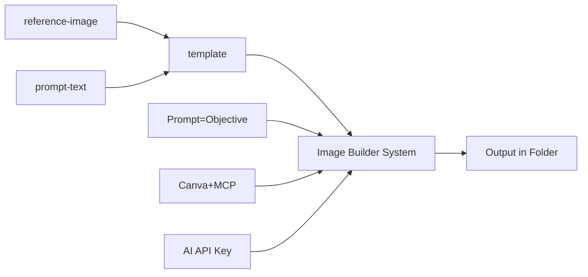

# Objectives Image Generator
* Generate image from reference image
* Use reference image as template and generate image from source text
* Use reference image as template and generate image from source another image
* Generate PDF (Slides) from reference images / PDF  from source text
* Generate PDF (Slides) from reference images / PDF  from source another pdf
* Use reference gif/mp4 as template and generate gif/mp4 from source text
* Use reference gif/mp4 as template and generate gif/mp4 from source another images/gif/mp4
 
## UI
### Add Reference Props
* Images
* GIFs
* PDF
* Youtube Links
 
### Build Templates
* Parts of an image
* Layouts (sizes, colors)
* Look and feel
 
### Template to Content
* Text + Templates = Output
* Reference Image + Templates = Output
 
### Template to Canva
 
### Canva to Content
# Objectives Image Generator
* Generate image from reference image
* Use reference image as template and generate image from source text
* Use reference image as template and generate image from source another image
* Generate PDF (Slides) from reference images / PDF  from source text
* Generate PDF (Slides) from reference images / PDF  from source another pdf
* Use reference gif/mp4 as template and generate gif/mp4 from source text
* Use reference gif/mp4 as template and generate gif/mp4 from source another images/gif/mp4
 
## UI
### Add Reference Props
* Images
* GIFs
* PDF
* Youtube Links
* Image Link
 
### Build Templates
* Parts of an image
* Layouts (sizes, colors)
* Look and feel
 
### Template to Content
* Text + Templates = Output
* Reference Image + Templates = Output
 
### Template to Canva
 
### Canva to Content
 
### site/project-management
* Code Repo-1
* project-management Repo-2/folder (MD)
 

